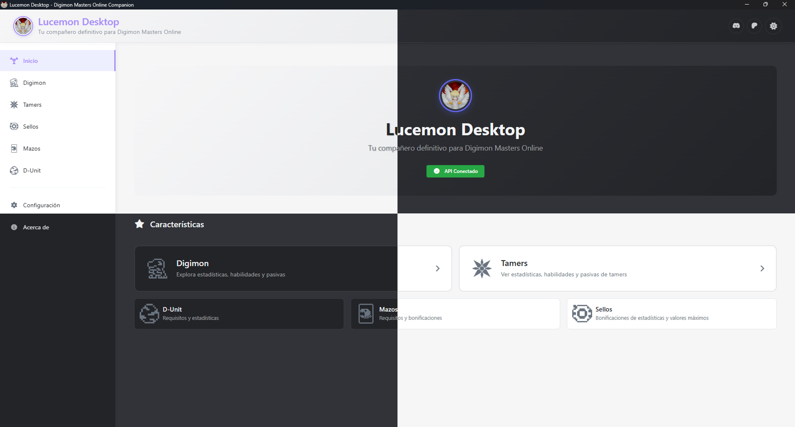

# Lucemon Desktop

> A comprehensive database and information tool for Digimon Masters Online players

  

## 📖 About

Lucemon Desktop is a comprehensive database application designed to provide Digimon Masters Online players with easy access to game information. Browse detailed Digimon stats, explore tamer abilities, manage deck information, and access seal data all in one modern, user-friendly interface.

## 📥 Download & Installation

### System Requirements

- **Operating System**: Windows 10 or later
- **Architecture**: 64-bit (x64)
- **RAM**: 4GB minimum
- **Storage**: 200MB available space

## 📊 Release History

### Recent Releases

| Version | Type | Release Date | Highlights |
|---------|------|--------------|------------|
| [v1.2605.2](https://github.com/RizeFury/lucemon-desktop/releases/tag/v1.2603.8) | Stable | 26 May 2026 | Most stable with tested features |
| [v1.2605.0-beta.2](https://github.com/RizeFury/lucemon-desktop/releases/tag/v1.2605.0-beta.2) | Beta | 26 May 2026 | Mostly stable with no tested features |

---

1. Download the latest `.exe` installer from the releases page
2. Run the installer
3. Launch Lucemon Desktop from your Start Menu or Desktop

### Getting Updates

Lucemon Desktop automatically checks for updates and will notify you when new versions are available. You can also:

1. **Check manually**: Go to **Help** → **Check for Updates**
2. **Change update channel**: Go to **Settings** → **Update Management**

## 🚀 Release Channels

We offer different release channels to suit your needs:

### 🛡️ Stable Channel *(Recommended)*
- **Best for**: Most users who want reliability
- **Updates**: Thoroughly tested features and bug fixes
- **Frequency**: Monthly releases
- **Stability**: ⭐⭐⭐⭐⭐

### 🧪 Beta Channel
- **Best for**: Users who want early access to new features
- **Updates**: Latest features with community testing
- **Frequency**: Weekly releases  
- **Stability**: ⭐⭐⭐⭐

> **Note**: You can switch between channels in the application settings under **Update Management**.

## ✨ Features

### Core Database Features
- **🐲 Digimon Database**: Complete search and filter system with:
  - Detailed stats, skills, and passive abilities
  - Advanced filtering by type, attribute, level, and more
  - Individual Digimon detail modals with comprehensive information
  - Search by name, description, and characteristics

- **👤 Tamer Database**: Comprehensive tamer information with:
  - Detailed tamer stats and abilities
  - Skill and passive browsing
  - Complete tamer profiles and information

- **🃏 Deck Management**: Full deck system featuring:
  - Deck browsing with Digimon lineup display
  - Buff and requirements

- **🔒 Seal System**: Advanced seal with:
  - Search and filter by stat categories (HP, DS, AT, CT, HT, DE, EV, BL)
  - Detailed seal information and bonuses
  - Stat bonus calculations and maximum values (Pending)
 
- **🛡️ D-Unit**: D-Unit information
  - Search and filter by stats
  - D-Unit requirement information

### Technical Features
- **📡 Multiple Release Channels**: Choose between Stable and Beta releases
- **🔄 Automatic Updates**: Stay up-to-date with the latest features and improvements
- **🌍 Multi-language Support**: Available in English, Spanish, and Portuguese
- **🎨 Modern UI**: Clean, responsive interface with dark/light theme support
- **⚡ Real-time Data**: Live connection to our own DMO database with caching for performance
- **📱 Responsive Design**: Works seamlessly on different screen sizes

## 🔧 Configuration

Lucemon Desktop works out of the box with sensible defaults. For advanced users who need custom configurations:

1. Open **Settings** from the main menu
2. Navigate to **Configuration**
3. Adjust settings as needed
4. Restart the application if prompted

## 🆘 Support & Help

### Getting Help

- **📚 Documentation**: Check our [Wiki](https://github.com/RizeFury/lucemon-desktop/wiki) for detailed guides
- **💬 Community**: Join our community discussions in [Issues](https://github.com/RizeFury/lucemon-desktop/issues)
- **🐛 Bug Reports**: Report issues on our [GitHub Issues](https://github.com/RizeFury/lucemon-desktop/issues/new) page
- **📥 Releases**: Download the latest versions from [GitHub Releases](https://github.com/rizefury/lucemon-desktop/releases)
- **💖 Support Development**: Help support the project on [Patreon](https://patreon.com/lucemonapp)
- **💬 Discord Community**: Join our [Discord Server](https://discord.gg/DaPZAKHXCy) for real-time chat and support

### Common Issues

**Q: The application won't start**  
A: Make sure you're running Windows 10 or later and have extracted the application to a permanent folder.

**Q: Updates aren't working**  
A: Check your internet connection and ensure Windows Defender isn't blocking the application.

**Q: Can I use this on Mac/Linux?**  
A: Currently, Lucemon Desktop is Windows-only. Mac and Linux support may be added in future releases.

## 🤝 Contributing

While this repository is primarily for releases, we welcome:

- 🐛 **Bug Reports** - Help us identify and fix issues
- 💡 **Feature Requests** - Suggest new features or improvements
- 🌐 **Translations** - Help us support more languages
- 📖 **Documentation** - Improve our guides and help docs

## 👥 Credits

**Developed by**: [RizeFury](https://github.com/RizeFury)  
**Community**: Thanks to all our beta testers and contributors!

**📱 [Download Now](https://github.com/RizeFury/lucemon-desktop/releases/latest) | 📚 [Documentation](https://github.com/RizeFury/lucemon-desktop/wiki) | 💬 [GitHub Issues](https://github.com/RizeFury/lucemon-desktop/issues) | 💖 [Patreon](https://patreon.com/lucemonapp) | 💬 [Discord](https://discord.gg/DaPZAKHXCy)**

*Made with ❤️ for the Digimon Masters Online community*

